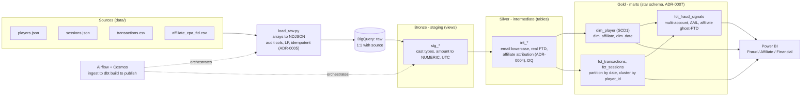

# Architecture

The pipeline lands four heterogeneous sources into BigQuery, models them through a Medallion
architecture with dbt, and serves fraud and financial signals to Power BI. Airflow orchestrates the run.

**How to read it.** Raw files land in `raw` untouched (idempotent load). Bronze casts types and
timezone. Silver conforms and applies the business rules (the affiliate attribution that removes the
209 ghost FTDs, ADR-0004). Gold is a star schema; the facts are partitioned by date and clustered by
`player_id` to keep BigQuery cheap. Only Gold feeds the dashboard. Airflow runs ingestion, then a
`dbt build`, then publishes.

**Load cadence** is per source (ADR-0008): sessions/transactions are incremental, players/affiliate
are full. Freshness, quality and cost targets are in ADR-0009.
